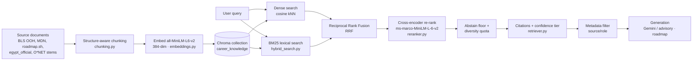

# RAG Architecture

How Sha8lny retrieves grounded knowledge for the advisory chat and roadmap
generation. The pipeline is a four-technique retrieval stack over a license-clean
corpus, measured end-to-end (see [`RAG_RETRIEVAL_EVAL.md`](RAG_RETRIEVAL_EVAL.md)
and [`EVALUATION_REPORT.md`](EVALUATION_REPORT.md)).

**Code:** `ai-models/src/rag/` (retrieval), `Backend/apps/advisory/llm_service.py`
and `Backend/apps/roadmaps/path_retriever.py` (consumers).

---

## Pipeline

## Corpus and chunking

- **Sources** are license-screened in [`DATASET_REGISTRY.md`](DATASET_REGISTRY.md):
  BLS Occupational Outlook Handbook (public domain), MDN (CC-BY-SA), curated
  Egyptian-market material (`egypt_official`), O*NET descriptor *stems* (numeric
  rating rows are **excluded** from RAG after a whitelist-bug post-mortem), and
  roadmap.sh tagged `quality_tier: dev_fallback` (personal-use only — used as a
  development fallback, never defended as the corpus).
- **Structure-aware chunking** (`chunking.py`) splits on headings / paragraph
  boundaries with sentence-boundary overlap, emitting `(text, metadata)` with
  `source`, `url`, `section`, `doc_type`, `quality_tier`. This replaced fixed
  500-char chunks; headings are retained as `section` metadata for citations.
- **Embeddings:** `all-MiniLM-L6-v2` (384-dim, 22M params, CPU-friendly). Chosen
  for $0-budget, offline operation; the honest tradeoff is that it is
  English-centric (Arabic/code-switched queries are a documented limitation).

## The four retrieval techniques

### 1. Hybrid retrieval (BM25 + dense, RRF)
`hybrid_search.py` fuses a BM25 lexical index with dense cosine results using
**Reciprocal Rank Fusion** (Cormack, Clarke & Büttcher, *SIGIR 2009*). Rank-based
fusion replaced the absolute `min_score` cutoff and was the single largest gain
(recall@5 0.209 → 0.536): BM25 catches exact-term queries — SOC codes, "CORS",
section keywords — that the embedding places below threshold. Degrades to
dense-only if `rank_bm25` or the index is unavailable.

### 2. Cross-encoder re-ranking
`reranker.py` re-orders the top fused pool with
`cross-encoder/ms-marco-MiniLM-L-6-v2`, which scores query–passage **jointly**
(Nogueira & Cho, *Passage Re-ranking with BERT*, 2019). Largest effect on
first-hit rank: MRR 0.396 → 0.553. Skipped with a logged warning if the model
can't load.

### 3. Citations + confidence tiering
`retriever.py` returns each document with `source`, `url`, `section`, and a
**HIGH/MEDIUM/LOW** `confidence_tier` derived from the rerank logit and the
source `quality_tier`. A **rerank-logit abstention floor** (default −6.0) returns
zero documents for off-topic queries at **zero metric cost** (every genuine hit
scores above the floor), driving the advisory's `no_retrieval_context` state
rather than confidently wrong answers. Surfaced end-to-end via
`llm_service.py`'s public citation contract and the `MessageSources` UI.

### 4. Metadata filtering
`retrieve_context` accepts a `filters` dict so consumers share one collection
cleanly: roadmap retrieval filters `source=roadmap.sh`
(`path_retriever.py`); advisory retrieves across the licensed corpus. A
**diversity quota** (≤2 chunks per file/section) trades redundant same-section
hits for source variety the generator benefits from.

## Generation

The retrieved, cited context is handed to Gemini (advisory chat, roadmap copy)
with a strict "answer only from retrieved knowledge" system prompt; every AI path
keeps a deterministic fallback so the demo survives a dead `GEMINI_API_KEY` or a
missing Chroma volume.

## Measured impact

Cumulative over the locked baseline on the **final abstention-floor pipeline**:
**recall@5 ×5.2 (0.609), MRR ×5.0 (0.544), precision@5 ×4.0 (0.218)**. The rerank
peak stage reaches recall@5 **0.627** / MRR **0.553** before diversity/abstention
trade-offs (`RAG_RETRIEVAL_EVAL.md`, every number traced to a committed
`ai-models/eval_results/retrieval/*.json`).

## Honest limitations

- English-only corpus + English-centric embedder → Arabic/code-switched queries
  fail (the most important gap for an Egyptian platform; multilingual embeddings
  + Arabic content are the documented upgrade path).
- Confidence tiering is rule-based, not calibrated to human judgments.
- 16/55 eval queries still miss in the top-10 (roadmap-category bleed); these are
  the evaluation loop's first targets.
