# Chapter 3 — Methodology and System Design

> **Chapter purpose.** Chapter 3 turns the gap and objectives into an engineered design. It
> captures the requirements (functional and non-functional), presents the architecture,
> justifies the major design decisions with explicit trade-offs, and models the system with
> DFDs and the full UML set. It tells *what* will be built and *why it is shaped this way* —
> the *how* (code) follows in Chapter 4. **Target length: 16–22 pages.**
>
> **Style.** Engineering prose. Use Mermaid/PlantUML for diagrams (renderable in the repo and
> exportable to images for the final document). Each diagram has a one-paragraph reading guide.

---

## 3.1 Development Methodology

**What to write.** State the software-process model and justify it. **(≈1 page.)**

We adopted an **iterative, incremental (Agile-inspired) methodology** organised into feature
"phases" (foundation and auth, assessment, roadmaps, jobs, advisory, then cross-cutting
progress/notifications/career-tools). Each phase delivered a vertical slice (backend models →
services → API → frontend) accompanied by automated tests, mirroring the project's actual
phase-based history. This model suited a small team building on uncertain AI components: it
allowed early end-to-end demos, continuous regression protection through the growing test
suite, and the freedom to refine AI behaviour without destabilising shipped modules.

> **Sample paragraph (drop-in).**
> "Because the behaviour of the language-model components could only be understood empirically,
> a waterfall plan would have been brittle. We therefore worked in short, test-guarded
> increments: each AI feature was first wrapped in a deterministic contract and a fallback,
> then refined against its tests, so that experimentation never compromised the integrity of
> the wider system."

---

## 3.2 Requirements Analysis

**What to write.** Elicit and tabulate functional and non-functional requirements. Number them
(FR-x, NFR-x) so they can be traced in testing (Chapter 5) and validated in discussion
(Chapter 6). **(≈4 pages.)**

### 3.2.1 Stakeholders and actors

- **Job-seeker / learner** (primary user).
- **System administrator** (manages content, platforms, courses via the Django admin).
- **AI runtime** (Gemini hosted / Ollama local) — an external service actor.
- **External data providers** — job fixtures/ingestion, O*NET, roadmap.sh corpus.

### 3.2.2 Functional requirements

**Table 3.1 — Functional requirements.**

| ID | Module | Requirement | Priority |
|----|--------|-------------|----------|
| FR-1 | Users | The system shall allow users to register and authenticate with email/password and issue JWT access/refresh tokens. | Must |
| FR-2 | Users | The system shall let users manage a profile, skills (with proficiency), and preferences. | Must |
| FR-3 | Users | The system shall compute a skill-gap analysis against a target role. | Should |
| FR-4 | Assessments | The system shall create a two-stage, role-aware assessment for any of 8 supported roles. | Must |
| FR-5 | Assessments | The system shall generate Stage 1 questions via the LLM, grounded by a role-aware scenario corpus, with a curated fallback. | Must |
| FR-6 | Assessments | The system shall derive a gap profile from Stage 1 and generate targeted Stage 2 questions. | Must |
| FR-7 | Assessments | The system shall compute a deterministic, weighted overall score independent of the LLM's self-reported score. | Must |
| FR-8 | Assessments | The system shall persist an assessment result with strengths, gaps, recommended careers, and a roadmap signal. | Must |
| FR-9 | Roadmaps | The system shall generate a personalised roadmap (phases → milestones → courses) from retrieved corpus structure, tailored to assessment gaps. | Must |
| FR-10 | Roadmaps | The system shall fall back to a deterministic template if retrieval yields nothing. | Must |
| FR-11 | Roadmaps | The system shall track and update phase/milestone progress and roadmap activation. | Should |
| FR-12 | Jobs | The system shall search jobs and compute a transparent skill-match score per user. | Must |
| FR-13 | Jobs | The system shall re-order matched jobs using a LightGBM learning-to-rank model and expose a match explanation. | Must |
| FR-14 | Jobs | The system shall let users save/unsave jobs. | Should |
| FR-15 | Advisory | The system shall answer career questions with retrieval-grounded, cited responses and enforce in/out-of-scope rules. | Must |
| FR-16 | Advisory | The system shall persist conversations and messages with token and citation metadata. | Should |
| FR-17 | Progress | The system shall track course completions, milestone achievements, time logs, and streaks. | Should |
| FR-18 | Notifications | The system shall create and manage in-app notifications and per-type preferences. | Could |
| FR-19 | Career Tools | The system shall manage resumes and portfolios and return structured ATS optimisation output. | Could |
| FR-20 | Platform | The system shall expose an OpenAPI-documented, versioned REST API (`/api/v1`). | Must |

### 3.2.3 Non-functional requirements

**Table 3.2 — Non-functional requirements.**

| ID | Attribute | Requirement | Design response |
|----|-----------|-------------|-----------------|
| NFR-1 | Security | All non-public endpoints require JWT; tokens rotate and blacklist on refresh. | Simple JWT (HS256), `IsAuthenticated` default permission |
| NFR-2 | Security | Inputs are validated and the API resists abuse of costly AI endpoints. | DRF serializers; AI throttles (3/min burst, 20/hour sustained) |
| NFR-3 | Performance | Interactive endpoints respond in < 300 ms (p95) excluding AI generation; AI tasks run asynchronously. | Redis cache, indexed queries, Celery `ai` queue |
| NFR-4 | Scalability | The system supports horizontal scaling of stateless API workers. | Stateless JWT; externalised cache/broker; `CONN_MAX_AGE` pooling |
| NFR-5 | Reliability | AI features degrade gracefully and never crash the request path. | Deterministic fallbacks; retrieval returns `[]` on failure; recomputed scores |
| NFR-6 | Availability | The platform tolerates LLM-provider outages. | Hosted Gemini default + local Ollama/Gemma fallback |
| NFR-7 | Maintainability | Clear module boundaries and a service layer enable independent evolution. | Modular monolith; `services.py` per app; shared `BaseModel` |
| NFR-8 | Usability | A responsive, accessible SPA with clear state feedback. | React + shadcn/Radix; route-level loading/empty/error states |
| NFR-9 | Portability | Runs in development (SQLite) and production (PostgreSQL) without code change. | Settings split (`base`/`development`/`production`) |
| NFR-10 | Observability | AI invocations are traced and health-checkable. | `ai_trace_id`, runtime health endpoint, structured logging |

### 3.2.4 Requirement elicitation method

Requirements were derived from (a) the problem analysis in Chapter 1, (b) the
literature-driven feature expectations in Chapter 2, and (c) lightweight persona/user-story
workshops within the team. Each user story maps to one or more FRs.

---

## 3.3 System Design

**What to write.** Present the architecture top-down: high-level architecture, component
architecture, and the principal end-to-end workflow. **(≈4 pages.)**

### 3.3.1 High-level architecture

Sha8lny is a **three-tier, modular-monolith** system:

1. **Presentation tier** — a React 18 + TypeScript SPA (Vite), communicating over HTTPS/JSON.
2. **Application tier** — a Django REST Framework backend organised into ten cohesive modules
   (apps), with a service layer and a Celery worker pool for asynchronous AI tasks.
3. **Data & AI tier** — PostgreSQL (relational state), Redis (cache + broker), a ChromaDB
   vector store, and the external LLM runtime (Gemini/Ollama). A dedicated `ai-models` Python
   package hosts the RAG pipeline and the LightGBM ranker and is imported by the backend.

**Figure 3.1 — High-level system architecture.** *(Mermaid source below; export to PNG/SVG for
the final document.)*

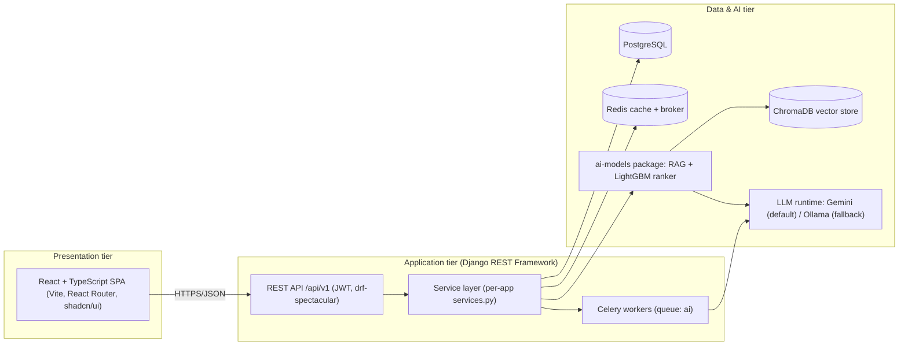

**Reading guide.** The SPA never talks to the data tier directly; all access is mediated by the
JWT-secured REST API. Long-running AI generation is dispatched to Celery so the request thread
is never blocked. The `ai-models` package is the single home of retrieval and ranking logic,
keeping ML concerns out of the web layer.

### 3.3.2 Component architecture

**Figure 3.2 — Component architecture (backend modules + AI package).**

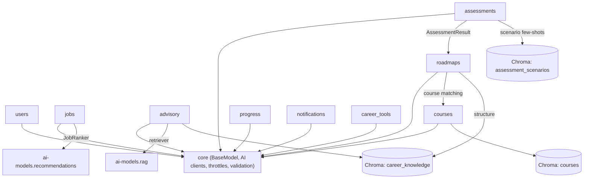

**Reading guide.** `core` is the shared foundation (the `BaseModel`, the `GemmaClient` LLM
abstraction, AI throttles, and validation utilities). Domain modules depend on `core` and, where
genuinely coupled, on one another (assessment results seed roadmaps; roadmaps match courses).
Three *separate* Chroma collections isolate concerns: `assessment_scenarios`, `career_knowledge`
(advisory + roadmap structure), and `courses`.

### 3.3.3 Principal workflow (end-to-end user journey)

**Figure 3.3 — Primary workflow.**

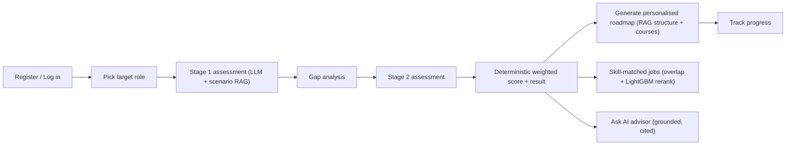

---

## 3.4 Design Decisions and Trade-offs

**What to write.** For each major decision: the choice, the alternatives considered, and the
trade-off. This is where examiners look for engineering judgement. **(≈3 pages.)**

**Table 3.3 — Key design decisions.**

| Decision | Chosen | Alternatives considered | Rationale / trade-off |
|----------|--------|-------------------------|------------------------|
| Backend architecture | Modular monolith (Django) | Microservices; plain monolith | Module boundaries + ACID transactions + simple deployment; can extract services later [18] |
| API framework | Django REST Framework | FastAPI; Flask | Batteries-included ORM, auth, admin, serialization; mature ecosystem [4] |
| Auth | Simple JWT (HS256) | Session cookies; full Auth0 OAuth | Stateless, SPA-friendly, horizontally scalable; Auth0 fields retained for future SSO |
| LLM runtime | Hosted Gemini default + Ollama fallback | Self-hosted only; hosted only | Reliable demos with an offline path; avoids single-vendor lock-in (NFR-6) |
| Trust model for LLM scores | LLM score **discarded**; deterministic recompute | Trust LLM score | Reproducibility and fairness; the LLM proposes, deterministic code disposes |
| Retrieval | Hybrid dense + BM25 + RRF + rerank + abstention | Dense-only | Robust to semantic and lexical queries; precision and safe abstention [9], [12] |
| Job ranking | LightGBM `lambdarank` reorder; overlap score shown | Deep LTR; pure overlap | Strong tabular learner [14] + user-facing interpretability |
| Vector store | ChromaDB (persistent) | FAISS; pgvector | Simple Python-native API, metadata filters, local persistence |
| Frontend | React + TS + Vite + shadcn/Radix | Next.js; Angular | Fast SPA DX, type safety, accessible primitives [5] |
| Async AI | Celery `ai` queue | In-request; threads | Keeps request path responsive; eager in dev for simplicity (NFR-3) |
| DB dev/prod split | SQLite dev / PostgreSQL prod | Postgres everywhere | Zero-setup local dev; production-grade prod (NFR-9) |

> **Sample paragraph (drop-in).**
> "The single most consequential decision was to *distrust the language model's own score*.
> Although Gemini readily returns a numeric competency estimate, that estimate is
> non-deterministic and unauditable. We therefore discard it and recompute the headline score
> deterministically from per-dimension evidence using role-graph weights that sum to one. This
> sacrifices a little fluency for a great deal of reproducibility and fairness — a trade-off we
> consider mandatory for an assessment instrument."

---

## 3.5 Data Flow Diagrams

**What to write.** Provide DFD Level 0 (context), Level 1 (major processes), and a Level 2
expansion of the most complex process (the assessment). Each DFD names external entities, data
stores, and data flows. **(≈3 pages.)**

### 3.5.1 DFD Level 0 — Context diagram

**Figure 3.4 — DFD Level 0.**

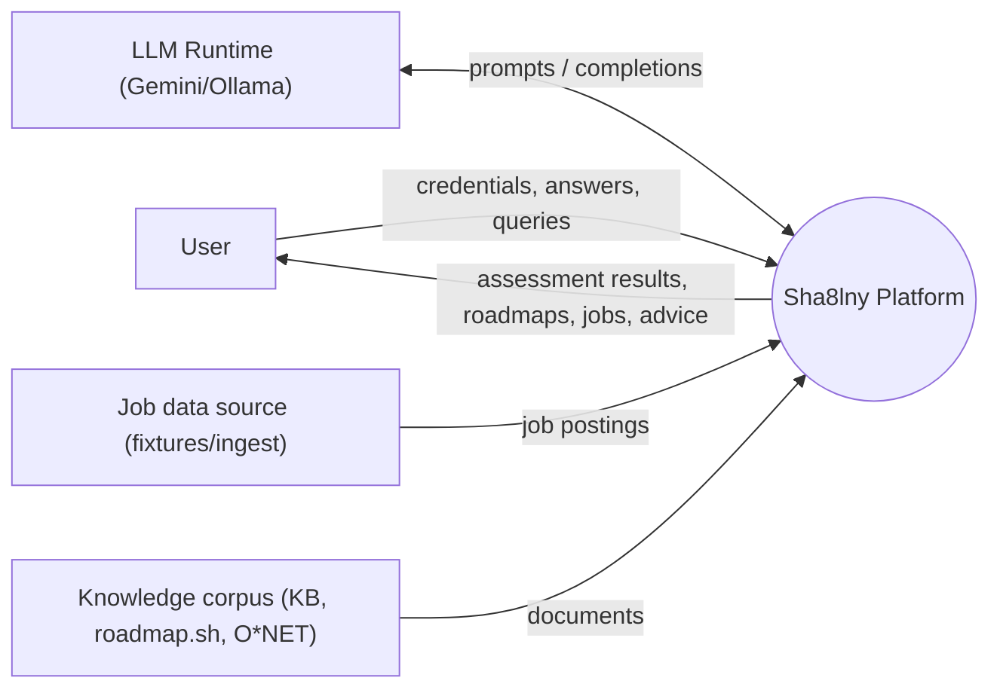

### 3.5.2 DFD Level 1 — Major processes

**Figure 3.5 — DFD Level 1.**

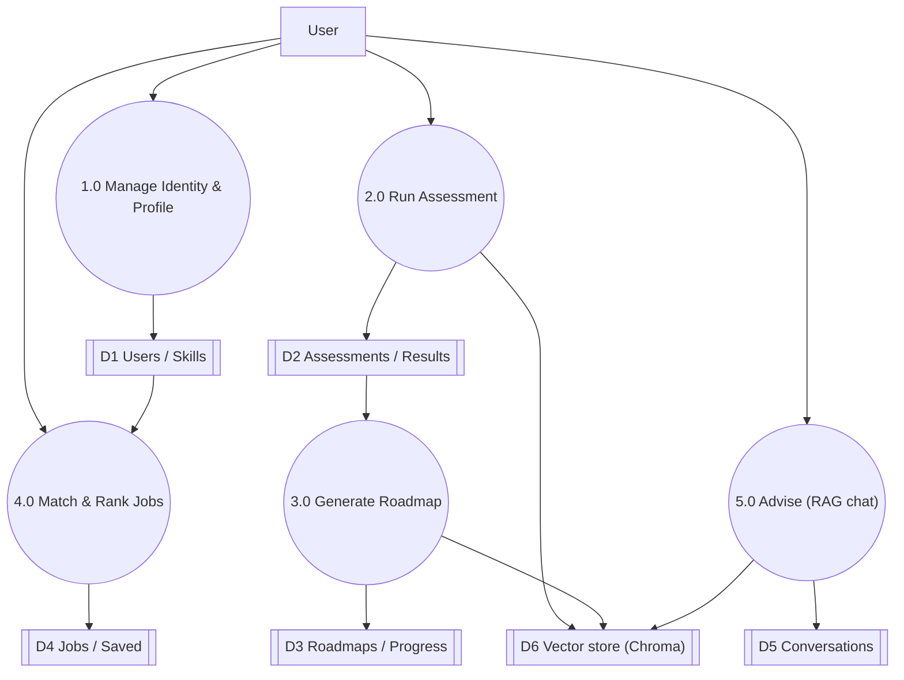

### 3.5.3 DFD Level 2 — Assessment process expanded

**Figure 3.6 — DFD Level 2 (Process 2.0 "Run Assessment").**

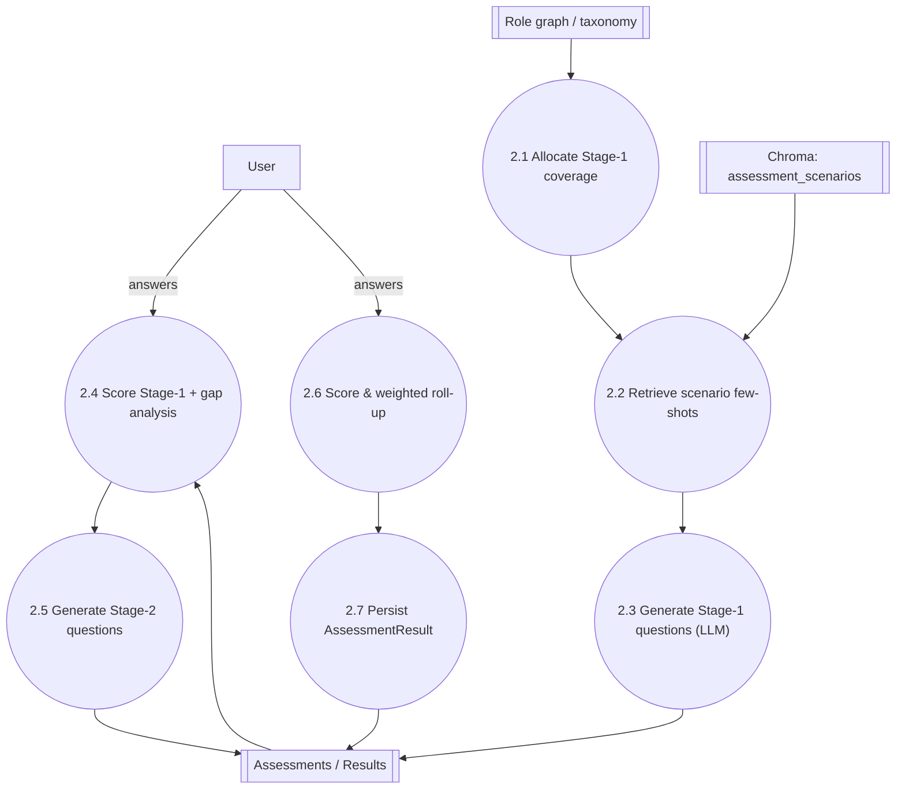

**Reading guide.** Coverage allocation (2.1) is driven by the role graph; few-shot retrieval
(2.2) is the assessment's RAG touch-point; generation (2.3) is the only LLM call in Stage 1;
crucially, scoring (2.4, 2.6) is deterministic and owns the headline number.

---

## 3.6 UML Models

**What to write.** Provide the standard UML set, each with a *reading guide* describing what
must appear. Diagrams can be drawn in Mermaid/PlantUML or a dedicated tool; the content
specification below is what matters for marks. **(≈4 pages.)**

### 3.6.1 Use-Case Diagram

**Figure 3.7 — Use-case diagram.** *What must appear:* actors **Learner**, **Administrator**,
and external **AI Runtime**; use cases grouped by module: *Register/Login*, *Manage
Profile/Skills*, *Take Assessment*, *View Results*, *Generate Roadmap*, *Track Progress*,
*Search/Match Jobs*, *Save Job*, *Chat with Advisor*, *Manage Resume/Portfolio*, *Manage
Notifications*; `<<include>>` from *Take Assessment* to *Generate Questions*; `<<extend>>` from
*View Results* to *Generate Roadmap*; the Administrator associated with content-management use
cases.

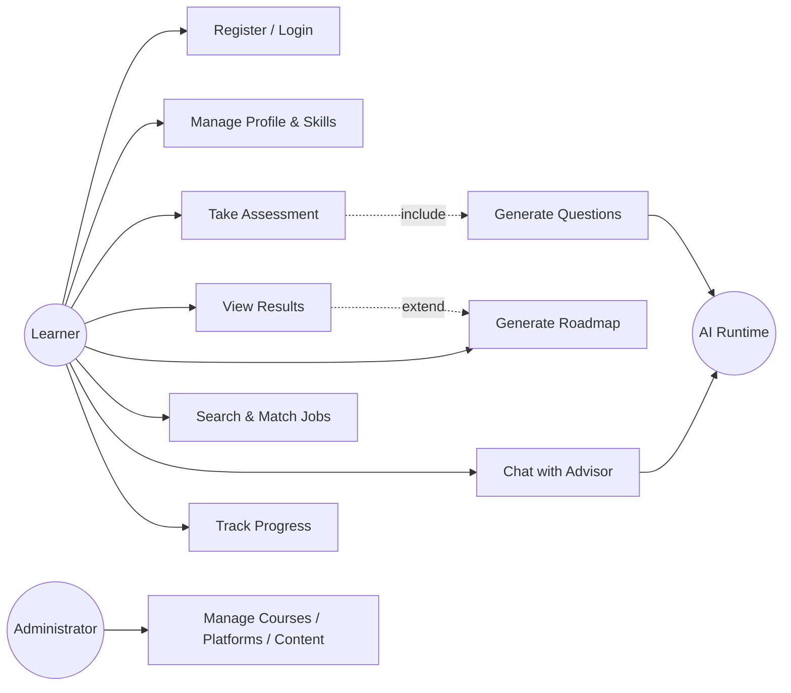

### 3.6.2 Class Diagram

**Figure 3.8 — Domain class diagram.** *What must appear:* the abstract `BaseModel` (UUID id,
created_at, updated_at, is_deleted) as the superclass; `User`, `Skill`, `UserSkill`,
`UserPreferences`; `Assessment`, `AssessmentResult`; `RoadmapTemplate`, `Roadmap`,
`RoadmapPhase`, `RoadmapMilestone`, `RoadmapCourse`; `Course`, `CoursePlatform`, `CourseSkill`;
`Job`, `JobPlatform`, `JobSkill`, `SavedJob`; `Conversation`, `Message`; with multiplicities
(e.g., `Roadmap 1..* RoadmapPhase`, `User 1..* UserSkill`, `Assessment 1—1 AssessmentResult`).
Show service classes (`AssessmentService`, `RoadmapService`, `JobService`,
`LLMAdvisoryService`) as a separate package depending on the models.

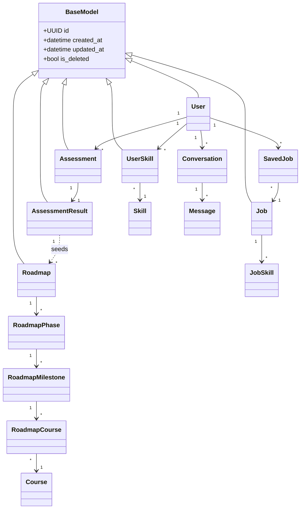

### 3.6.3 Activity Diagram

**Figure 3.9 — Activity diagram for "Take Assessment".** *What must appear:* start node;
actions for create → generate Stage 1 → answer → submit → score/gap → generate Stage 2 →
answer → submit → weighted score → persist result; a decision node for the staged-vs-legacy
path and another for "retrieval available?"; a fork/join for asynchronous Celery generation
(user sees a polling/loading state while the task runs); end node.

### 3.6.4 Sequence Diagram

**Figure 3.10 — Sequence diagram for "Submit assessment and receive result".** *What must
appear (lifelines):* `SPA`, `AssessmentViewSet`, `AssessmentService`, `Celery`,
`AssessmentAIService`, `GemmaClient`, `ScenarioRetriever`, `Database`. Show: SPA → `POST
/assessment/{id}/submit/` → 202 Accepted; the service enqueues a Celery task; the task calls
the AI service which retrieves few-shots and calls the LLM; the score is recomputed
deterministically and persisted; SPA polls `GET /assessment/{id}/result/` (202 while
processing, 200 on completion).

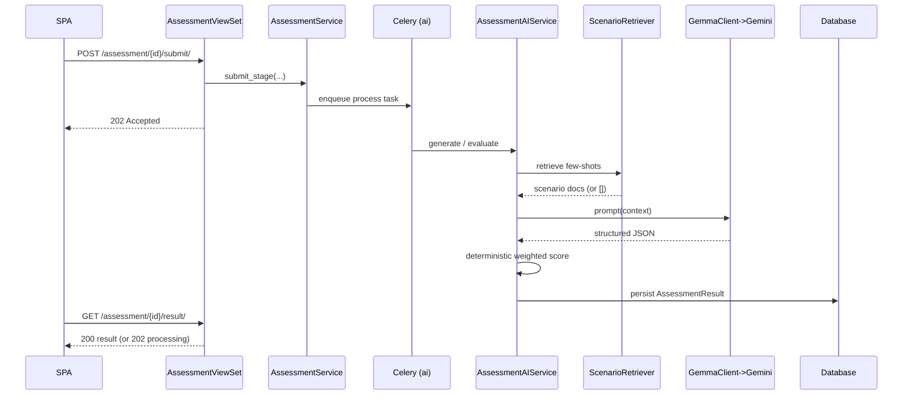

### 3.6.5 State Diagram

**Figure 3.11 — State diagram for an Assessment.** *What must appear:* states `created` →
`stage_1` → `stage_1_submitted/processing` → `stage_2` → `stage_2_submitted/processing` →
`completed`; an orthogonal `ai_processing_status` (`pending` → `processing` →
`completed`/`failed`) with a transition from `failed` back to a retried/fallback state.

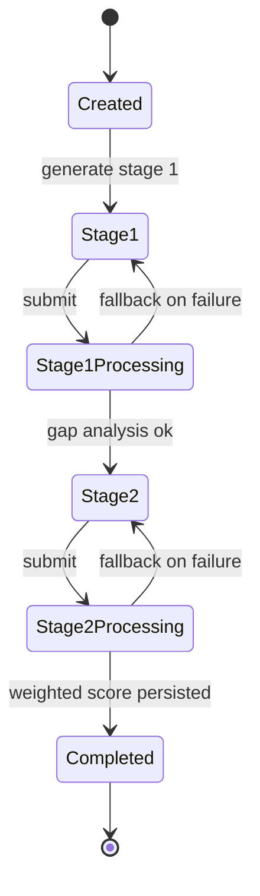

### 3.6.6 Deployment Diagram

**Figure 3.12 — Deployment diagram.** *What must appear:* a **client device** running the
browser SPA; an **application server** node running Gunicorn/ASGI + the Django app and a
**Celery worker** node; a **PostgreSQL** node; a **Redis** node; a **ChromaDB persistent
volume**; and the **external Gemini API** (with the optional on-host Ollama). Show protocols:
HTTPS (client↔app), TCP (app↔Postgres/Redis), local FS (Chroma), HTTPS (app↔Gemini).

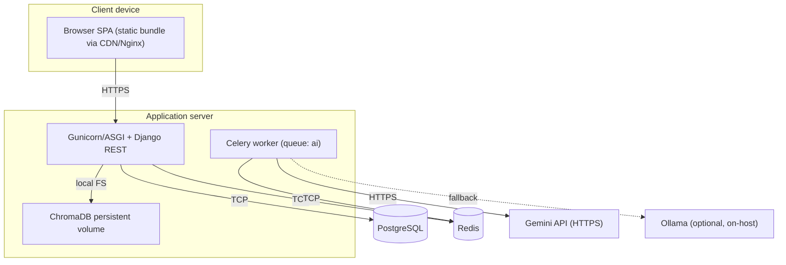

---

## 3.7 Summary

Close by linking design to objectives: "The architecture and models above satisfy the
requirements of §3.2 and operationalise the objectives of §1.4; Chapter 4 realises them in
code."

---

## Chapter 3 — Visual assets summary

| # | Type | Caption | Placement |
|---|------|---------|-----------|
| Figure 3.1 | Architecture | "High-level system architecture of Sha8lny." | §3.3.1 |
| Figure 3.2 | Component diagram | "Component architecture: backend modules and AI package." | §3.3.2 |
| Figure 3.3 | Flow | "Primary end-to-end user workflow." | §3.3.3 |
| Figure 3.4–3.6 | DFD L0/L1/L2 | "Context, major-process, and assessment data-flow diagrams." | §3.5 |
| Figure 3.7–3.12 | UML | "Use-case, class, activity, sequence, state, and deployment diagrams." | §3.6 |
| Table 3.1 | Table | "Functional requirements." | §3.2.2 |
| Table 3.2 | Table | "Non-functional requirements." | §3.2.3 |
| Table 3.3 | Table | "Key design decisions and trade-offs." | §3.4 |

**Citations introduced/used in this chapter:** [4], [5], [9], [12], [14], [18].
